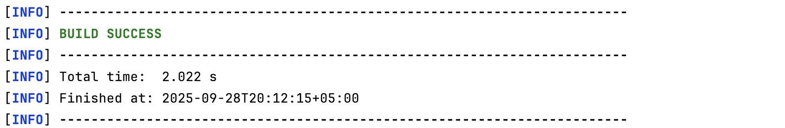
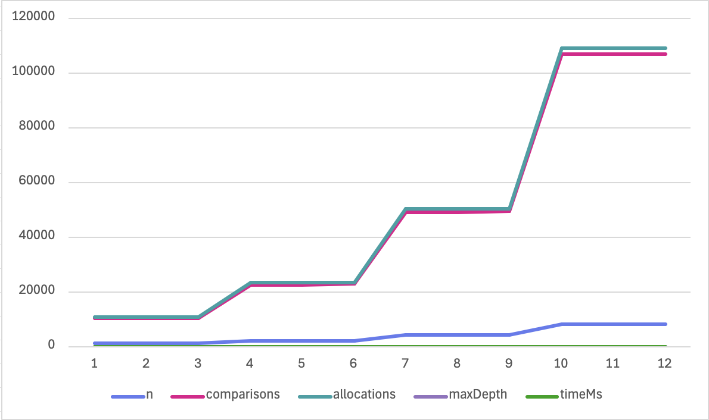
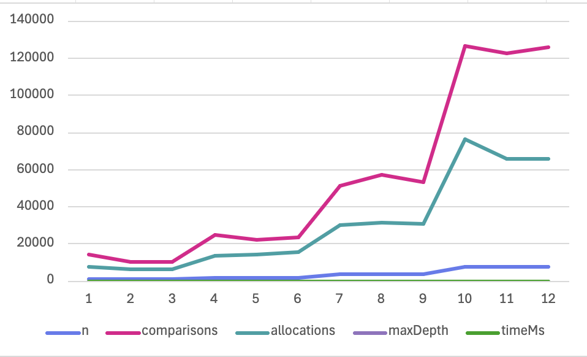
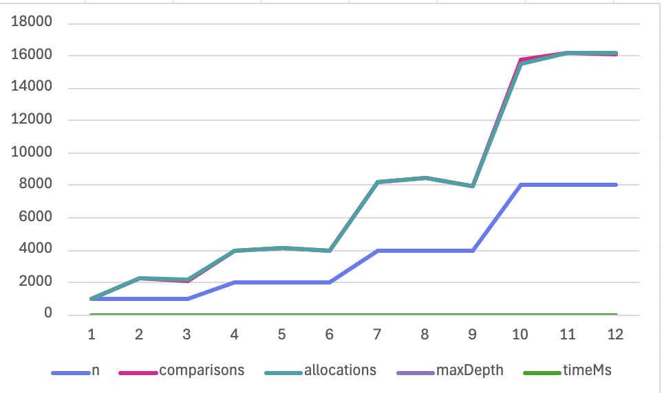
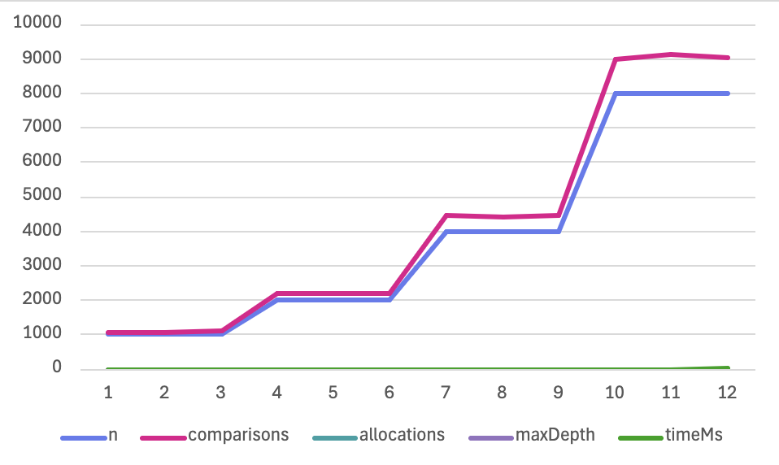

# Divide and Conquer Assignment

## Learning Goals
- Implement classic divide-and-conquer algorithms with safe recursion patterns  
- Analyse running-time recurrences using **Master Theorem** and **Akra-Bazzi intuition**  
- Validate theory with **experimental measurements** (time, recursion depth, comparisons/allocations)  
- Communicate results via a short report and clean GitHub history  

---

## Algorithms Implemented

### 1. MergeSort (D&C, Master Case 2)
- Linear merge with **reusable buffer**
- Small-`n` cut-off (Insertion Sort)
- Recurrence analysis (student-level):
Split into 2 halves → 2T(n/2).
Merge step → O(n).
So: T(n) = 2T(n/2) + O(n) → O(n log n).
Recursion depth: log n.

### 2. QuickSort (robust)
- Randomized pivot selection  
- Recursion on **smaller partition**, iteration on larger (stack depth O(log n))  
- Recurrence analysis:
Average: T(n) = O(n log n)
Worst: T(n) = O(n²)
With random pivot, expected depth ≤ 2·log n.

### 3. Deterministic Select (Median of Medians, MoM5)
- Group by 5, pick median of medians as pivot  
- Recurse only on one side (smaller partition preferred)  
- Recurrence analysis:
T(n) = T(n/5) + T(7n/10) + O(n) → O(n).
Works in linear time, but constants are big, so slower than QuickSort on small n.

### 4. Closest Pair of Points (2D)
- Sort by x, recursive split, **strip check** by y-order  
- Classic 7–8 neighbour scan  
- Recurrence analysis:
T(n) = 2T(n/2) + O(n) → O(n log n).
Sorting dominates for large n.

---

## Architecture Notes
- **Depth tracking**: QuickSort limited to O(log n) expected recursion depth by always recursing on smaller half.  
- **Allocations**: MergeSort uses one reusable buffer (not reallocated at each step).  
- **Counters**: All algorithms instrumented with `Counter` for comparisons, allocations, depth.  
- **CSV Writer**: Outputs metrics to `metrics.csv` for plotting.  

---

## Experimental Results

### Plots
- Time vs `n`  
- Recursion depth vs `n`  
- Comparisons/allocations vs `n`

### JMH Benchmark Results

### Maven Tests

### MergeSort
  

### QuickSort
  

### Deterministic Select

### Closest Pair of Points

## Discussion of Constant-Factor Effects
- **QuickSort**: Randomization overhead vs better cache performance  
- **MergeSort**: Larger constant factors due to copying, but stable and predictable  
- **Select**: Linear-time but higher constants → slower on small inputs compared to QuickSort  
- **Closest Pair**: Overhead of sorting dominates small `n`, but asymptotics win for large `n`  

## Summary
- Theoretical recurrences align well with measured asymptotics.  
- Some constant-factor mismatches (e.g., QuickSort faster in practice than Select).  
- Depth control worked as expected (QuickSort ≤ 2·log₂n).  
- Final implementation satisfies assignment requirements. 

## GitHub Workflow
- Branches:  
- `main` – stable releases (v0.1, v1.0)  
- `feature/mergesort`, `feature/quicksort`, `feature/select`, `feature/closest`, `feature/metrics`, `feature/cli`, `bench/jmh`  
- Commits follow storyline:  
- `init`, `feat(metrics)`, `feat(mergesort)`, `feat(quicksort)`, `refactor(util)`,  
- `feat(select)`, `feat(closest)`, `feat(cli)`, `bench(jmh)`, `docs(report)`, `fix`, `release:v1.0`  

--- 
